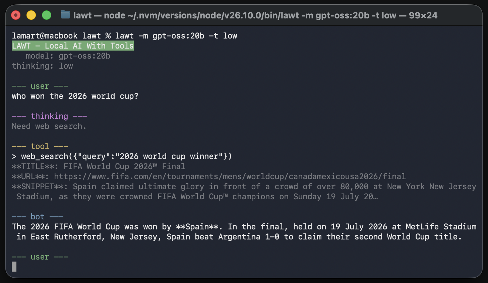

# LAWT

[](https://github.com/lamartinecabral/lawt/actions/workflows/test.yml)
[](./LICENSE)


**Local AI With Tools** is a small terminal agent for OpenAI-compatible models. It can work with files in the current directory, run shell commands, and search the web.

`lawt` is intentionally a minimal implementation: the code should be easy for anyone to understand, own, and adapt to their own workflow. Its small surface area also keeps the context sent to local models clean and lightweight, leaving more room for the task at hand.



## Requirements

- Node.js 24 or newer
- Ollama running locally, or another OpenAI-compatible provider

## Run

```bash
npm install
npm run install:lawt
lawt --model <model>
```

Use `--think <effort>` to set reasoning effort, `--resume` to continue the session for the current working directory, or `--list` to print the available models. Options can also be passed as `-m`, `-t`, `-r`, and `-l`. The selected model and reasoning effort are saved in `~/.lawt/settings.json`.

## Using the assistant

Enter a prompt at the terminal. For a multi-line prompt, put `"""` on a line by itself before and after the text. Available commands are `/exit` or `/quit` to leave, `/export` to save the conversation as JSON, and `/model` to list available models.

The assistant can browse and edit files in the current workspace, run shell commands, and search or fetch web pages. Optional instructions load from `./AGENTS.md` or `~/.lawt/AGENTS.md`. Sessions are saved under `~/.lawt/sessions/` by working directory. See [docs/ollama.md](docs/ollama.md) for Ollama usage tips.

## Providers

Use `~/.lawt/provider.ts` to configure a different OpenAI-compatible model provider or a cloud web search provider:

```ts
export default {
  // Optional: use a non-default model provider
  baseURL: "https://api.example.com/v1",
  apiKey: "your-api-key",
  // Optional: choose one web search backend
  webSearch: {
    local: { chromePath: "default" },
    // or local: { chromePath: "path/to/chrome" },
    // or tavily: { apiKey: "your-tavily-api-key" },
    // or ollama: { apiKey: "your-ollama-cloud-api-key" },
  },
};
```

For more details on web search settings, see [github.com/lamartinecabral/web-search](https://github.com/lamartinecabral/web-search).

## Development

```bash
npm run lint
npm run typecheck
npm test
```
